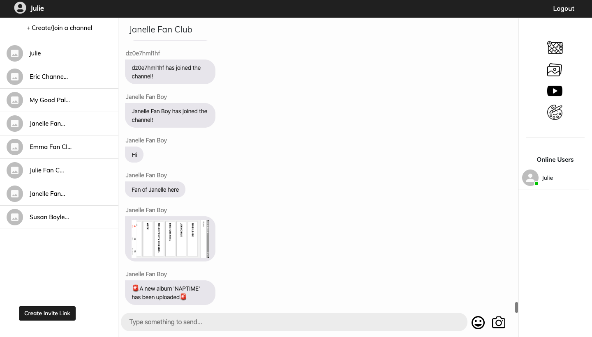
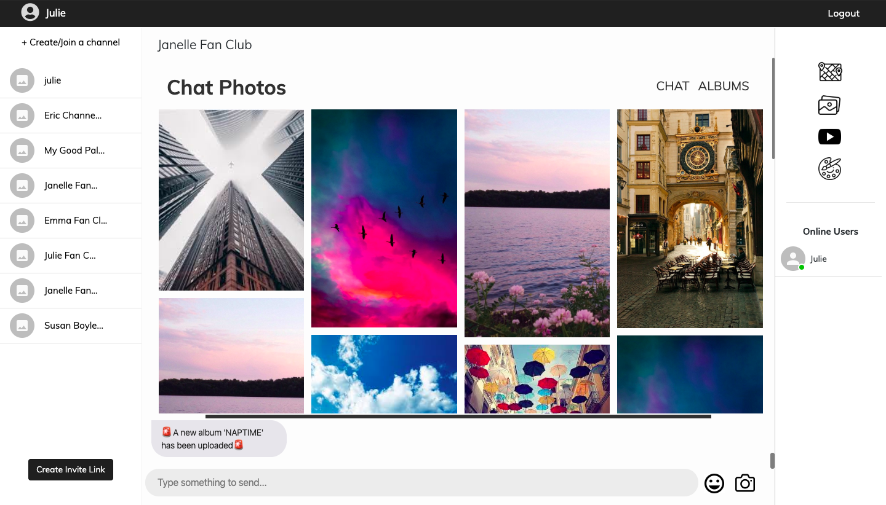
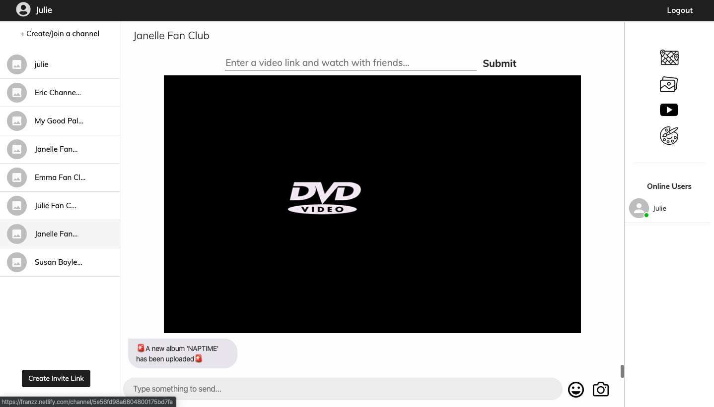
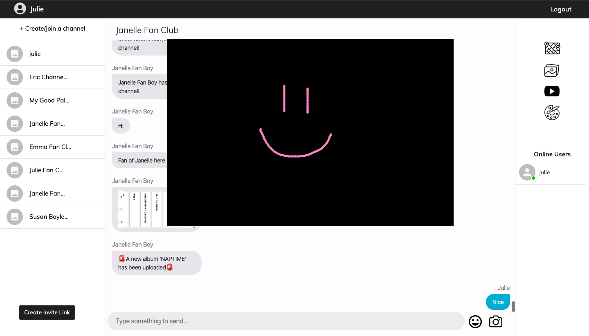
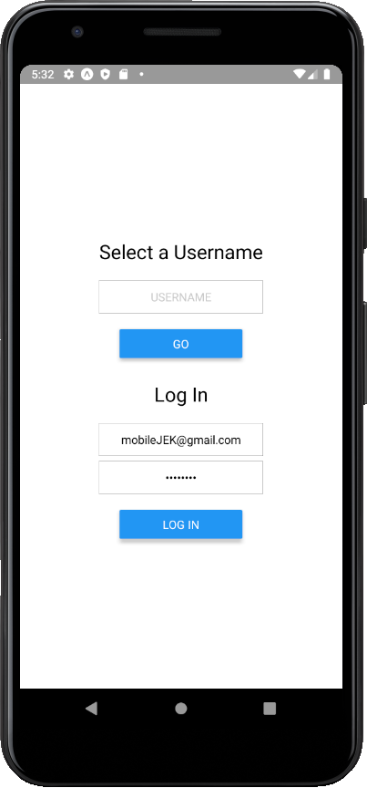
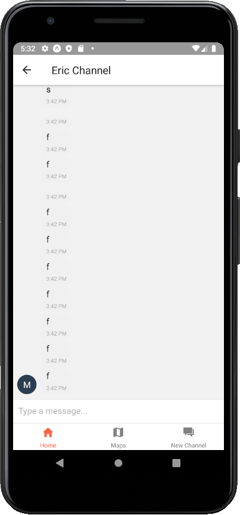

# Franzz 🤗

Franzz is a messaging web application focused on connecting groups of franzz (friends) together with multiple unique features.

### Features

1. Stalking map: View your group's live location on a map
2. Photo gallery: Create share high quality photos and videos with your friends by creating albums
3. Youtube: Watch Youtube together with your group of friends while messaging
4. Drawing board: Need to sketch something out together? You can do it using this drawing board!

## Setup

### Cloudinary

### GOOGLE

Enable APIs for:

1. YouTube Data API v3
2. Maps JavaScript API
3. Geolocation API

and

1. OAuth 2.0 Client IDs

### MongoDB

Create a database and add the connection string to server/.env

## Installation 👾

For both client and server run:

```
npm install
npm start
```

For mobile, expo CLI is required:

```
npm i -g expo-cli
```

then install dependencies and start:

```
npm install
expo start
```

## Deployment

Client - [Franzz](https://franzz.netlify.com)
Server - [Franzz API](https://arcane-bastion-72484.herokuapp.com)

## Main Dependencies

### Client

```
"axios": "^0.19.2",
"cloudinary": "^1.19.0",
"google-map-react": "^1.1.6",
"react": "^16.12.0",
"react-dom": "^16.12.0",
"react-router-dom": "^5.1.2",
"react-youtube": "^7.9.0",
"socket.io-client": "^2.3.0"
"@react-native-community/async-storage": "^1.8.0",
```

### Mobile

```
"socket.io-client": "2.1.1"
"axios": "^0.19.2",
"expo": "~36.0.0",
"@react-navigation/native": "^5.0.0",
"react-native-gifted-chat": "^0.13.0",
"react-native-storage": "^1.0.1",
"react-native-maps": "^0.26.1",
```

### Server

```
"axios": "^0.19.2",
"bcrypt": "^3.0.7",
"cloudinary": "^1.19.0",
"body-parser": "^1.19.0",
"jsonwebtoken": "^8.5.1",
"mongoose": "^5.8.10",
"passport": "^0.4.1",
"socket.io": "^2.3.0",
```

## Work Distribution

### :muscle: juliebede

### melonfruity

### ke2low

?

## Screenshots 📸

### Client









### Mobile







